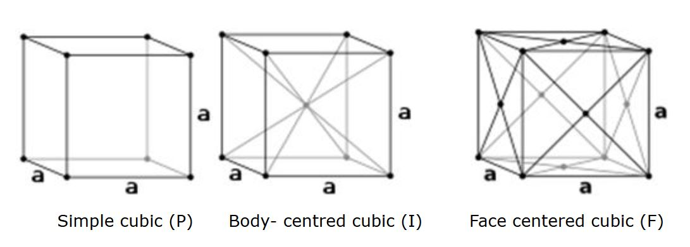

## Theory 

Matter exist usually in solid or fluid (liquid, gas) state. According to modern concept matter classification is specified as condensed state and gaseous state. Solids and liquids come under condensed state. Any material whose position of constituent particles is fixed can be regarded as solids.

 

Solids are characterized by incompressibility, rigidity and mechanical strength. This indicates that the molecules, atoms or ions that make up as solid is closely packed. Thus in solids we will have a well ordered molecular, atomic or ionic arrangement.

In general solids can be classified into:

 

- Crystalline-particles are orderly arranged (long range order).
- Amorphous-particles are randomly oriented.
 

If the atoms or molecules are uniquely arranged in crystalline solid or liquid we call it as a crystal structure. A crystal posses long range order and symmetry. The main property of crystal structure is its periodicity. This periodicity is due to the arrangement of atoms/molecules in the lattice points. The crystal structure as a whole can be considered as the repetition of unit cell. For a given crystal structure the shape of unit cell is same but varies from crystal to crystal.

 

X-ray diffraction studies reveal that the constituent particles (molecules, atoms or ions) are arranged in a definite pattern in the crystal. To get the diffraction pattern the wavelength of light used must be comparable with the atomic spacing.

### Lattice
 

A crystal structure is formed only when the group of atoms is arranged identically at the lattice point. The group of atoms or molecules is called a basis. Lattice point is actually an imaginary concept.

 

 

In other way, we can say that,

Lattice + Basis=crystal structure

 

Line joining any two points is a translation in lattice. Two non-collinear translation leads to a plane lattice and three non coplanar translation leads to a space lattice.

## Unit cell
 

Unit cell can be considered as the building block of a crystal. It has the same symmetry as the entire crystal. When we arrange the unit cell in 3D, we get the bulk crystal. In other words it can be described as the smallest volume which when repeated in all direction gives the crystal. The three edges a, b, c along the axis and angle between them α, β and γ is termed as lattice parameters. In 3D it is better to consider a parallelepiped as unit cell.

 

 

Unit cell can be of primitive as well as non primitive type. A primitive cell is a minimum volume unit cell and has only one lattice point in it and the latter contains more than one.

 

In the given figure below, simple cube is a primitive cell. No.of atoms per unit cell is one for it. The rest two is non primitive. No.of atoms per unit cell is 2 and 4 respectively.

 

## Bravais Lattice in Two Dimensions - Plane Lattice

  

 

In general, the number of lattices obtained is unlimited since there is no restriction on the length $a, b$ of the lattice translations or the angle $\theta$ between them. Such a lattice for arbitrary $a, b$ and $\theta$ is known as an **oblique lattice**. This oblique lattice is invariant under rotation of $\frac{2\pi}{n}$ (with $n = 1$ and $2$). It can also be made invariant under rotation of $\frac{2\pi}{n}$ with $n = 3, 4,$ and $6$.

### Special Cases:

- For $a = b$ and $\theta = 90^\circ$: **Square lattice**
- For $a \ne b$ and $\theta = 90^\circ$: **Rectangular lattice**
- For $a = b$ and $\theta \ne 90^\circ$: **Rhombus lattice**
- For $a = b$ and $\theta = 60^\circ$: **Hexagonal lattice**

## Bravais Lattice in Three Dimensions - Space Lattice

Based on the lattice parameters $a, b, c, \alpha, \beta, \gamma$ and applying certain restrictions, only **14 types of lattices** are possible in three dimensions: one general (**triclinic**) and thirteen special types.

Only **seven different systems of axes** are sufficient to represent all Bravais lattices. These fourteen space lattices are grouped into **seven crystal systems**.

### The Seven Crystal Systems:

- Triclinic  
- Monoclinic  
- Orthorhombic  
- Tetragonal  
- Trigonal  
- Hexagonal  
- Cubic

<table cellpadding="5" cellspacing="0">
  <thead>
    <tr>
      <th>Serial No:</th>
      <th>Lattice Systems</th>
      <th>Simple</th>
      <th>Base-centered</th>
      <th>Body-centered</th>
      <th>Face-centered</th>
      <th>Example</th>
    </tr>
  </thead>
  <tbody>
    <tr>
      <td>1</td>
      <td>Triclinic (none)</td>
      <td></td>
      <td></td>
      <td></td>
      <td></td>
      <td>CuSO₄·5H₂O, K₂Cr₂O₇</td>
    </tr>
    <tr>
      <td>2</td>
      <td>Monoclinic (1 diad)</td>
      <td></td>
      <td></td>
      <td></td>
      <td></td>
      <td>CaSO₄·2H₂O, FeSO₄, Na₂SO₄</td>
    </tr>
    <tr>
      <td>3</td>
      <td>Orthorhombic (3 perpendicular diads)</td>
      <td></td>
      <td></td>
      <td></td>
      <td></td>
      <td>KNO₃, BaSO₄</td>
    </tr>
    <tr>
      <td>4</td>
      <td>Rhombohedral (1 triad)</td>
      <td></td>
      <td></td>
      <td></td>
      <td></td>
      <td>As, Sb, Bi</td>
    </tr>
    <tr>
      <td>5</td>
      <td>Tetragonal (1 tetrad)</td>
      <td></td>
      <td></td>
      <td></td>
      <td></td>
      <td>TiO₂, SnO₂, NiSO₄</td>
    </tr>
    <tr>
      <td>6</td>
      <td>Hexagonal (1 hexad)</td>
      <td></td>
      <td></td>
      <td></td>
      <td></td>
      <td>SiO₂, Zn, Mg, Cd</td>
    </tr>
    <tr>
      <td>7</td>
      <td>Cubic (4 triads)</td>
      <td></td>
      <td></td>
      <td></td>
      <td></td>
      <td>Au, Cu, NaCl</td>
    </tr>
  </tbody>
</table>

### Atomic Packing Fraction (APF)
 

Atomic packing fraction mainly gives us an idea about the arrangement of atoms/ions in solids. It will give the efficiency with which the available space is being filled by atoms.

Packing fraction is defined as the ratio of volume of atoms occupying the unit cell to the volume of unit cell.

$$\text{APF}=\frac{\text{Volume of atoms in unit cell}}{\text{Volume of unit cell}}$$

#### Examples:

1.    Simple Cubic

  

 

Consider a cube of side 'a' .Atoms of radius 'r' is placed at the corner. So that length of cube a=2r.

$$\text{Volume of atoms in unit cell}=\frac{4\pi r^3}{3}$$

In a simple cubic structure, the atoms occupies at the eight corners. An atom at the corner is equally shared by 8 unit cells. So the contribution of one atom to a unit cell is 1/8. Therefore the no. of atoms per unit cell is (1/8)*8(corner atoms) =1.

$$\text{Volume of unit cell}=a^3=(2r)^3 =8r^3$$

$$\text{APF}=\frac{\frac{4}{3}\pi r^3}{8r^3}=\frac{\pi}{6}=52\%$$

2. Body-Centered Cube

  

 

Consider a cube of side $a$, and atoms of radius $r$ placed at the corners and at the body center. The length of the body diagonal is given by:

$$\sqrt{3}a = 4r$$

$$\text{Volume of Atoms in Unit Cell}=2*\frac{4}{3}\pi r^3=\frac{8\pi r^3}{3}$$

In a body centered cube, there will be one atom at the centre along with 8 corner atoms. This corner atom is shared by 8 unit cell and the atom at the centre is not a shared one. Therefore no. of atoms per unit cell= (1/8)*8(corner atoms)+1(body centre)=2.

$$\text{Volume of unit cell}=a^3=\left(\frac{4r}{\sqrt{3}} \right)^3$$

$$APF = \frac{\frac{8\pi r^3}{3}}{\frac{64r^3}{3\sqrt{3}}} = \frac{\sqrt{3}\pi}{8} = 68\%$$

3. Face-Centered Cube

  

 

Consider a cube of length $a$, and atoms of radius $r$ placed at the corners as well as at the face centers.

The length of the face diagonal is given by: $\sqrt{2}a = 4r$

$$\text{Volume of unit cell}= \frac{4*4}{3}\pi r^3=\frac{16}{3}\pi r^3$$

In a face centered cube, each face possess one atom along with 8 corner atoms. The atoms at the faces are equally shared by two unit cell. Corner atoms by 8 unit cells. So the no. of atoms per unit cell is=(1/8)*8(corner atoms)+(1/2)*6(atoms at face)=4.

$$\text{Volume of unit cell}= a^3=\left( \frac{4r}{\sqrt{2}} \right)^3$$

$$APF = \frac{\frac{16}{3} \pi r^3}{\left(\frac{4r}{\sqrt{2}}\right)^3} = \frac{\pi}{3\sqrt{2}} = 74\%$$

